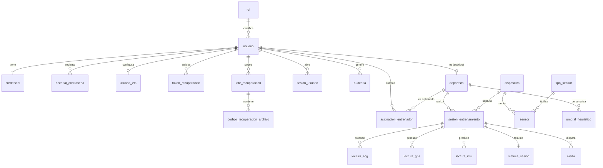

# PhysioScan — Blueprint Técnico (esquema sistematizado)

> **Proyecto:** PhysioScan — Servicio web para el monitoreo del rendimiento deportivo mediante un chaleco inteligente con sensores biométricos.
> **Autor:** Camilo Ramírez Jiménez · Institución Universitaria de El Espinal (UniEspinal).
> **Stack obligado (según el artículo):** HTML5 + CSS3 + JavaScript + Three.js r128 (presentación) · Python 3 + Flask 3.1.x (lógica) · MySQL + `mysql-connector-python` (persistencia).
> **Hardware:** ESP32-WROOM-32 · NEO-7M (GPS/UART) · AD8232 (ECG analógico) · MPU-6050 GY-521 (IMU/I2C) · LiPo 1S 2000 mAh.
> **Metodología:** Programación Extrema (XP) — diseño simple, entregas pequeñas, integración continua, refactorización.
> **Este documento es la fuente de verdad.** Va en el repo como `docs/ARQUITECTURA.md` y se resume en `CLAUDE.md`. Cada sesión de Claude Code debe leerlo antes de tocar código.

---

## 0. Índice

1. Principios de arquitectura (modelo en capas)
2. Estructura de carpetas del proyecto
3. Decisión de diseño: identificadores (autoincremental vs. trigger)
4. Modelo Entidad–Relación (MER) y normalización
5. Esquema de base de datos (DDL completo + triggers + seed)
6. Arquitectura de seguridad (defensa en profundidad)
   - 6.1 2FA (verificación en dos pasos)
   - 6.2 Recovery code por correo
   - 6.3 Archivo de 12 recuperaciones
   - 6.4 Matriz de controles (OWASP / ISO 27001 / Ley 1581)
7. Capa de presentación: home page, holograma 3D, sistema de diseño
8. Integración de sensores (ESP32 → Flask) + contrato de datos + firmware
9. Motor heurístico (fatiga / sobreesfuerzo) y métricas
10. Requisitos funcionales y no funcionales
11. Dependencias y variables de entorno

---

## 1. Principios de arquitectura (modelo en capas)

Tres capas con dependencia **unidireccional hacia abajo**. Una capa **nunca** llama hacia arriba ni salta una capa.

```
┌─────────────────────────────────────────────────────────────┐
│  CAPA DE PRESENTACIÓN  (app/presentacion + templates + static)│
│  Controladores Flask (Blueprints), Jinja2, CSS, JS, Three.js  │
│  Responsabilidad: HTTP, render, validación de FORMATO de input│
└───────────────┬─────────────────────────────────────────────┘
                │  (DTOs / dataclasses, nunca filas crudas de SQL)
┌───────────────▼─────────────────────────────────────────────┐
│  CAPA DE LÓGICA DE NEGOCIO  (app/negocio)                     │
│  Servicios: auth, 2FA, recuperación, ingesta, métricas,       │
│  heurística, auditoría. Reglas, validación SEMÁNTICA, política│
│  de seguridad. NO sabe de HTTP ni de SQL.                     │
└───────────────┬─────────────────────────────────────────────┘
                │  (interfaces de repositorio)
┌───────────────▼─────────────────────────────────────────────┐
│  CAPA DE ACCESO A DATOS  (app/datos)                          │
│  Repositorios/DAO + pool de conexiones mysql-connector.       │
│  ÚNICA capa que escribe SQL. SIEMPRE consultas parametrizadas.│
└───────────────┬─────────────────────────────────────────────┘
                ▼
            MySQL 8.x  (esquema normalizado + triggers)
```

**Reglas duras (las verifica el revisor en cada sesión):**

- Los controladores **no** escriben SQL ni reglas de negocio: delegan en servicios.
- Los servicios **no** importan `flask`, `request`, ni `mysql.connector`: reciben datos ya validados de formato y devuelven DTOs o lanzan excepciones de dominio.
- Los repositorios **no** contienen reglas de negocio: solo CRUD parametrizado y mapeo fila→DTO.
- Todo lo transversal (hashing, tokens, validadores, decoradores de rol) vive en `app/comun`.
- Nada de credenciales en el código: todo por variables de entorno (`config.py` + `.env`).

---

## 2. Estructura de carpetas del proyecto

```
physioscan/
├── run.py                     # Punto de entrada desarrollo (create_app + app.run)
├── wsgi.py                    # Punto de entrada producción (gunicorn/waitress)
├── config.py                  # Config por entorno (Desarrollo/Produccion/Pruebas) desde .env
├── .env.example               # Plantilla de variables (SIN secretos reales)
├── .gitignore                 # Ignora .env, __pycache__, *.recovery, venv/
├── requirements.txt
├── README.md
├── CLAUDE.md                  # Resumen del blueprint para Claude Code
├── docs/
│   ├── ARQUITECTURA.md        # (este documento)
│   ├── MER.mmd                # Diagrama ER en Mermaid
│   └── API.md                 # Contrato de endpoints de ingesta
├── database/
│   ├── 01_schema.sql          # Tablas (DDL)
│   ├── 02_triggers.sql        # Trigger de codigo_usuario + auditoría
│   ├── 03_seed.sql            # Roles, admin inicial, tipos de sensor, umbrales
│   └── 04_vistas.sql          # Vistas de reporte (opcional)
├── app/
│   ├── __init__.py            # Application factory: create_app(config)
│   ├── extensions.py          # login_manager, csrf, limiter, mail, talisman, pool
│   ├── presentacion/          # ── CAPA PRESENTACIÓN ──
│   │   ├── __init__.py
│   │   ├── publico_controlador.py      # home, visión/misión/objetivos
│   │   ├── auth_controlador.py         # login, registro, logout, verificar-2fa
│   │   ├── recuperacion_controlador.py # recovery por correo + por archivo
│   │   ├── deportista_controlador.py
│   │   ├── entrenador_controlador.py
│   │   ├── admin_controlador.py        # gestión usuarios, reemitir archivo
│   │   ├── sesion_controlador.py       # UI de sesiones de entrenamiento
│   │   └── api_ingesta_controlador.py  # /api/v1 ingesta desde el chaleco
│   ├── negocio/               # ── CAPA LÓGICA DE NEGOCIO ──
│   │   ├── __init__.py
│   │   ├── auth_servicio.py
│   │   ├── deportista_servicio.py
│   │   ├── sesion_servicio.py
│   │   ├── ingesta_servicio.py
│   │   ├── metricas_servicio.py
│   │   ├── heuristica_servicio.py
│   │   └── seguridad/
│   │       ├── __init__.py
│   │       ├── contrasena_servicio.py        # Argon2id, política, historial
│   │       ├── doble_factor_servicio.py      # TOTP + email OTP
│   │       ├── recuperacion_email_servicio.py
│   │       ├── recuperacion_archivo_servicio.py
│   │       └── auditoria_servicio.py
│   ├── datos/                 # ── CAPA ACCESO A DATOS ──
│   │   ├── __init__.py
│   │   ├── conexion.py                 # Pool mysql-connector
│   │   ├── base_repositorio.py         # ejecutar(), uno(), muchos(), tx()
│   │   ├── usuario_repositorio.py
│   │   ├── seguridad_repositorio.py    # 2fa, tokens, lotes, codigos, sesiones, auditoría
│   │   ├── deportista_repositorio.py
│   │   ├── dispositivo_repositorio.py
│   │   ├── sesion_repositorio.py
│   │   ├── lectura_repositorio.py
│   │   └── alerta_repositorio.py
│   ├── modelos/               # DTOs / dataclasses (no ORM)
│   │   ├── usuario.py
│   │   ├── deportista.py
│   │   ├── sesion.py
│   │   └── lecturas.py
│   ├── comun/                 # Transversal
│   │   ├── seguridad_utils.py  # hash_password, verify, generar_token, comparacion_segura
│   │   ├── validadores.py      # email, contraseña, lat/lon, rangos
│   │   ├── decoradores.py      # @rol_requerido, @doble_factor_verificado
│   │   ├── errores.py          # excepciones de dominio + handlers
│   │   └── respuestas.py       # helpers JSON uniformes
│   ├── templates/             # Jinja2 (autoescape ON)
│   │   ├── base.html
│   │   ├── publico/  home.html · vision_mision.html
│   │   ├── auth/     login.html · registro.html · verificar_2fa.html
│   │   ├── recuperacion/ solicitar.html · por_archivo.html · nueva_contrasena.html
│   │   ├── deportista/ · entrenador/ · admin/
│   │   └── componentes/ navbar.html · footer.html · _macros.html · alertas.html
│   └── static/
│       ├── css/  tokens.css · base.css · componentes.css · holograma.css · responsive.css
│       ├── js/   holograma3d.js · dashboard.js · tiempo_real.js · validacion.js
│       ├── fonts/  (Bahnschrift, fallback, mono autohospedadas)
│       └── img/
├── firmware/
│   ├── physioscan_chaleco/physioscan_chaleco.ino
│   ├── config.h.example       # SSID, PASS, SERVER_URL, DEVICE_KEY
│   └── README_firmware.md
└── tests/
    ├── conftest.py
    ├── test_auth.py
    ├── test_doble_factor.py
    ├── test_recuperacion_archivo.py
    ├── test_ingesta.py
    └── test_heuristica.py
```

---

## 3. Decisión de diseño: identificadores (autoincremental vs. trigger)

Esta es una decisión deliberada de nivel senior, no un detalle. La regla profesional para una base **normalizada** es:

**La clave primaria debe ser sustituta (surrogate), inmutable y sin significado de negocio.**

Por eso:

- **TODAS las tablas** usan `INT UNSIGNED AUTO_INCREMENT` como **clave primaria técnica** (`id_usuario`, `id_sesion`, …). Es la clave que viaja en **todas las llaves foráneas**. Es compacta, rápida en índices y joins, y nunca cambia.
- **La tabla `usuario`** lleva **además** un **código de negocio legible** `codigo_usuario` `CHAR(7)` **único**, con el formato que pediste: **5 cifras + inicial del primer nombre + inicial del primer apellido** (p. ej. `10001CR` para *Camilo Ramírez*). Se genera con un **trigger `BEFORE INSERT`**.

**¿Por qué NO usar `codigo_usuario` como PK / como FK?** Porque incrusta las iniciales del nombre: si un usuario corrige su nombre, una clave natural cambiaría y rompería la integridad referencial y la 3FN (dependencia derivada). El código legible es para **mostrar** (login alternativo, reportes, tarjetas), no para **relacionar**. Esta separación es exactamente lo que distingue un MER impecable de uno frágil.

**¿Cómo genera el trigger un correlativo estable de 5 cifras?** Con una **tabla de secuencia** y un incremento atómico (`LAST_INSERT_ID`), seguro ante concurrencia (ver §5). Arranca en `10000`, así el primer usuario es `10001XX` y el rango de 5 cifras cubre 90 000 usuarios; ampliar es trivial (cambiar `LPAD(..,6,..)`).

| Tabla | PK | Estrategia | Código de negocio |
|---|---|---|---|
| `usuario` | `id_usuario` AI | Surrogate + **trigger** | `codigo_usuario` `CHAR(7)` (5 dígitos + 2 iniciales) |
| `dispositivo` | `id_dispositivo` AI | Surrogate + código legible | `codigo_dispositivo` `CHAR(8)` (p. ej. `CHAL0001`) |
| Resto de tablas | `id_*` AI | Surrogate puro (autoincremental) | — |

---

## 4. Modelo Entidad–Relación (MER) y normalización

### 4.1 Entidades (20)

**Identidad y seguridad**
1. `rol` — catálogo de roles (admin, entrenador, deportista).
2. `usuario` — identidad + perfil base + estado de cuenta.
3. `credencial` — (1:1 usuario) hash de contraseña y metadatos del algoritmo.
4. `historial_contrasena` — (1:N) hashes anteriores (evita reuso).
5. `usuario_2fa` — (1:1) secreto TOTP cifrado / método 2FA.
6. `token_recuperacion` — (1:N) OTP de un solo uso por correo (reset, verificación email, 2FA por correo).
7. `lote_recuperacion` — (1:N) “el archivo” de 12 códigos; un lote activo por usuario.
8. `codigo_recuperacion_archivo` — (1:N por lote) los 12 códigos de un solo uso (hasheados).
9. `sesion_usuario` — (1:N) sesiones de login del lado servidor (revocables).
10. `intento_login` — (1:N) auditoría de intentos para anti–fuerza bruta.
11. `auditoria` — (1:N) bitácora de eventos de seguridad y acciones de admin.

**Dominio deportivo**
12. `deportista` — (1:1 con usuario, opcional) perfil del atleta.
13. `asignacion_entrenador` — (M:N) entrenador ↔ deportista.
14. `dispositivo` — el chaleco/ESP32; autenticación por API key hasheada.
15. `tipo_sensor` — catálogo (ECG, GPS, IMU).
16. `sensor` — instancia física de sensor montada en un dispositivo.
17. `sesion_entrenamiento` — sesión de captura de un deportista con un dispositivo.
18. `lectura_ecg` — (1:N) muestras de ECG/BPM.
19. `lectura_gps` — (1:N) muestras de posición/velocidad.
20. `lectura_imu` — (1:N) muestras de acelerómetro/giroscopio/inclinación.

**Derivadas / configuración (apoyo)**
- `metrica_sesion` — (1:1 con sesión) agregados calculados (**denormalización justificada**, ver §4.3).
- `alerta` — (1:N) alertas heurísticas (fatiga, sobreesfuerzo, electrodo suelto, postura).
- `umbral_heuristico` — parámetros configurables del motor de reglas (global o por deportista).

### 4.2 Diagrama ER (Mermaid — pégalo en `docs/MER.mmd`)



### 4.3 Justificación de normalización (1FN → 3FN/BCNF)

- **1FN:** sin grupos repetidos ni multivaluados. Los nombres compuestos se separan en `primer_nombre`, `segundo_nombre`, `primer_apellido`, `segundo_apellido` (clave también para el trigger de iniciales). Las tres lecturas tienen tablas propias en vez de un campo JSON polimórfico.
- **2FN:** sin dependencias parciales. No hay PKs compuestas; cada atributo depende de la PK completa (sustituta).
- **3FN / BCNF:** sin dependencias transitivas. El método 2FA, las credenciales y el perfil de deportista se separan en tablas 1:1 para aislar datos sensibles/esparcidos. El rol está en su catálogo (`rol`), no como texto repetido en `usuario`.
- **Denormalizaciones controladas y documentadas (no son errores, son decisiones):**
  - `metrica_sesion` guarda agregados derivables (FC media/máx, distancia, velocidad). Se mantiene como **caché de lectura** para no recalcular millones de muestras en cada vista; la **fuente de verdad** son las tablas `lectura_*`. La pobla `metricas_servicio` al cerrar la sesión.
  - `lote_recuperacion.codigos_usados` es un contador cacheado; siempre verificable contando `codigo_recuperacion_archivo` usados.
  - Ambas se marcan en comentarios SQL como derivadas.

---

## 5. Esquema de base de datos (DDL completo)

> Va en `database/01_schema.sql`, `02_triggers.sql`, `03_seed.sql`. MySQL 8.x, `utf8mb4`, InnoDB. Todas las FK con `ON UPDATE CASCADE` y `ON DELETE` según semántica (RESTRICT para catálogos, CASCADE para hijos dependientes).

### 5.1 `01_schema.sql`

```sql
CREATE DATABASE IF NOT EXISTS physioscan
  CHARACTER SET utf8mb4 COLLATE utf8mb4_0900_ai_ci;
USE physioscan;

-- ───────────────────────── Identidad y seguridad ─────────────────────────
CREATE TABLE rol (
  id_rol        TINYINT UNSIGNED AUTO_INCREMENT PRIMARY KEY,
  nombre        VARCHAR(30)  NOT NULL UNIQUE,
  descripcion   VARCHAR(150) NULL
) ENGINE=InnoDB;

CREATE TABLE secuencia_codigo (        -- soporte para el trigger de codigo_usuario
  nombre_secuencia VARCHAR(50) PRIMARY KEY,
  valor_actual     INT UNSIGNED NOT NULL
) ENGINE=InnoDB;

CREATE TABLE usuario (
  id_usuario        INT UNSIGNED AUTO_INCREMENT PRIMARY KEY,   -- PK técnica (FKs)
  codigo_usuario    CHAR(7) NULL UNIQUE,                       -- 5 dígitos + 2 iniciales (trigger)
  primer_nombre     VARCHAR(40)  NOT NULL,
  segundo_nombre    VARCHAR(40)  NULL,
  primer_apellido   VARCHAR(40)  NOT NULL,
  segundo_apellido  VARCHAR(40)  NULL,
  email             VARCHAR(120) NOT NULL UNIQUE,              -- almacenar en minúscula
  telefono          VARCHAR(20)  NULL,
  id_rol            TINYINT UNSIGNED NOT NULL,
  estado            ENUM('pendiente_verificacion','activo','inactivo','bloqueado')
                      NOT NULL DEFAULT 'pendiente_verificacion',
  email_verificado  BOOLEAN NOT NULL DEFAULT FALSE,
  intentos_fallidos TINYINT UNSIGNED NOT NULL DEFAULT 0,
  bloqueado_hasta   DATETIME NULL,
  ultimo_acceso     DATETIME NULL,
  fecha_creacion    DATETIME NOT NULL DEFAULT CURRENT_TIMESTAMP,
  fecha_actualizacion DATETIME NOT NULL DEFAULT CURRENT_TIMESTAMP
                      ON UPDATE CURRENT_TIMESTAMP,
  CONSTRAINT fk_usuario_rol FOREIGN KEY (id_rol)
    REFERENCES rol(id_rol) ON UPDATE CASCADE ON DELETE RESTRICT,
  INDEX idx_usuario_email (email),
  INDEX idx_usuario_estado (estado)
) ENGINE=InnoDB;

CREATE TABLE credencial (                       -- 1:1 con usuario (aísla el secreto)
  id_usuario       INT UNSIGNED PRIMARY KEY,
  hash_contrasena  VARCHAR(255) NOT NULL,        -- Argon2id
  algoritmo        VARCHAR(20)  NOT NULL DEFAULT 'argon2id',
  fecha_cambio     DATETIME NOT NULL DEFAULT CURRENT_TIMESTAMP,
  requiere_cambio  BOOLEAN NOT NULL DEFAULT FALSE,
  CONSTRAINT fk_credencial_usuario FOREIGN KEY (id_usuario)
    REFERENCES usuario(id_usuario) ON UPDATE CASCADE ON DELETE CASCADE
) ENGINE=InnoDB;

CREATE TABLE historial_contrasena (
  id_historial   BIGINT UNSIGNED AUTO_INCREMENT PRIMARY KEY,
  id_usuario     INT UNSIGNED NOT NULL,
  hash_contrasena VARCHAR(255) NOT NULL,
  creado_en      DATETIME NOT NULL DEFAULT CURRENT_TIMESTAMP,
  CONSTRAINT fk_histpwd_usuario FOREIGN KEY (id_usuario)
    REFERENCES usuario(id_usuario) ON UPDATE CASCADE ON DELETE CASCADE,
  INDEX idx_histpwd_usuario (id_usuario)
) ENGINE=InnoDB;

CREATE TABLE usuario_2fa (                       -- 1:1, opcional
  id_usuario      INT UNSIGNED PRIMARY KEY,
  metodo          ENUM('totp','email') NOT NULL DEFAULT 'totp',
  secreto_totp    VARBINARY(255) NULL,           -- cifrado en reposo (Fernet)
  habilitado      BOOLEAN NOT NULL DEFAULT FALSE,
  confirmado      BOOLEAN NOT NULL DEFAULT FALSE,
  fecha_activacion DATETIME NULL,
  CONSTRAINT fk_2fa_usuario FOREIGN KEY (id_usuario)
    REFERENCES usuario(id_usuario) ON UPDATE CASCADE ON DELETE CASCADE
) ENGINE=InnoDB;

CREATE TABLE token_recuperacion (                -- OTP de un solo uso por correo
  id_token     BIGINT UNSIGNED AUTO_INCREMENT PRIMARY KEY,
  id_usuario   INT UNSIGNED NOT NULL,
  token_hash   CHAR(64) NOT NULL,                -- SHA-256 del token enviado
  tipo         ENUM('reset_password','verificacion_email','2fa_email') NOT NULL,
  expira_en    DATETIME NOT NULL,
  usado        BOOLEAN NOT NULL DEFAULT FALSE,
  usado_en     DATETIME NULL,
  ip_solicitud VARCHAR(45) NULL,
  creado_en    DATETIME NOT NULL DEFAULT CURRENT_TIMESTAMP,
  CONSTRAINT fk_token_usuario FOREIGN KEY (id_usuario)
    REFERENCES usuario(id_usuario) ON UPDATE CASCADE ON DELETE CASCADE,
  INDEX idx_token_hash (token_hash),
  INDEX idx_token_usuario_tipo (id_usuario, tipo, usado)
) ENGINE=InnoDB;

CREATE TABLE lote_recuperacion (                 -- "el archivo" de 12 códigos
  id_lote        BIGINT UNSIGNED AUTO_INCREMENT PRIMARY KEY,
  id_usuario     INT UNSIGNED NOT NULL,
  numero_lote    SMALLINT UNSIGNED NOT NULL DEFAULT 1,   -- 1 al crear, +1 cada reemisión
  total_codigos  TINYINT UNSIGNED NOT NULL DEFAULT 12,
  codigos_usados TINYINT UNSIGNED NOT NULL DEFAULT 0,    -- caché (verificable)
  activo         BOOLEAN NOT NULL DEFAULT TRUE,          -- solo UN lote activo por usuario
  generado_por   INT UNSIGNED NULL,                      -- admin que reemitió; NULL si fue en el registro
  generado_en    DATETIME NOT NULL DEFAULT CURRENT_TIMESTAMP,
  CONSTRAINT fk_lote_usuario FOREIGN KEY (id_usuario)
    REFERENCES usuario(id_usuario) ON UPDATE CASCADE ON DELETE CASCADE,
  CONSTRAINT fk_lote_admin FOREIGN KEY (generado_por)
    REFERENCES usuario(id_usuario) ON UPDATE CASCADE ON DELETE SET NULL,
  INDEX idx_lote_usuario_activo (id_usuario, activo)
) ENGINE=InnoDB;

CREATE TABLE codigo_recuperacion_archivo (       -- los 12 códigos del lote
  id_codigo    BIGINT UNSIGNED AUTO_INCREMENT PRIMARY KEY,
  id_lote      BIGINT UNSIGNED NOT NULL,
  orden        TINYINT UNSIGNED NOT NULL,         -- 1..12
  codigo_hash  VARCHAR(255) NOT NULL,             -- Argon2id del código mostrado una sola vez
  usado        BOOLEAN NOT NULL DEFAULT FALSE,
  usado_en     DATETIME NULL,
  CONSTRAINT fk_codigo_lote FOREIGN KEY (id_lote)
    REFERENCES lote_recuperacion(id_lote) ON UPDATE CASCADE ON DELETE CASCADE,
  UNIQUE KEY uq_lote_orden (id_lote, orden)
) ENGINE=InnoDB;

CREATE TABLE sesion_usuario (                     -- sesiones de login del lado servidor
  id_sesion_usuario BIGINT UNSIGNED AUTO_INCREMENT PRIMARY KEY,
  id_usuario     INT UNSIGNED NOT NULL,
  token_hash     CHAR(64) NOT NULL,
  ip             VARCHAR(45) NULL,
  user_agent     VARCHAR(255) NULL,
  creado_en      DATETIME NOT NULL DEFAULT CURRENT_TIMESTAMP,
  expira_en      DATETIME NOT NULL,
  revocado       BOOLEAN NOT NULL DEFAULT FALSE,
  CONSTRAINT fk_sesionu_usuario FOREIGN KEY (id_usuario)
    REFERENCES usuario(id_usuario) ON UPDATE CASCADE ON DELETE CASCADE,
  INDEX idx_sesionu_token (token_hash)
) ENGINE=InnoDB;

CREATE TABLE intento_login (
  id_intento   BIGINT UNSIGNED AUTO_INCREMENT PRIMARY KEY,
  identificador VARCHAR(120) NOT NULL,            -- email intentado (puede no existir)
  exito        BOOLEAN NOT NULL,
  ip           VARCHAR(45) NULL,
  user_agent   VARCHAR(255) NULL,
  creado_en    DATETIME NOT NULL DEFAULT CURRENT_TIMESTAMP,
  INDEX idx_intento_id_fecha (identificador, creado_en),
  INDEX idx_intento_ip_fecha (ip, creado_en)
) ENGINE=InnoDB;

CREATE TABLE auditoria (
  id_auditoria BIGINT UNSIGNED AUTO_INCREMENT PRIMARY KEY,
  id_usuario   INT UNSIGNED NULL,
  accion       VARCHAR(60)  NOT NULL,             -- LOGIN_OK, 2FA_FAIL, PWD_RESET, LOTE_REEMITIDO...
  entidad      VARCHAR(40)  NULL,
  id_entidad   VARCHAR(40)  NULL,
  ip           VARCHAR(45)  NULL,
  user_agent   VARCHAR(255) NULL,
  detalle      JSON NULL,
  creado_en    DATETIME NOT NULL DEFAULT CURRENT_TIMESTAMP,
  CONSTRAINT fk_audit_usuario FOREIGN KEY (id_usuario)
    REFERENCES usuario(id_usuario) ON UPDATE CASCADE ON DELETE SET NULL,
  INDEX idx_audit_usuario_fecha (id_usuario, creado_en),
  INDEX idx_audit_accion (accion)
) ENGINE=InnoDB;

-- ───────────────────────── Dominio deportivo ─────────────────────────
CREATE TABLE deportista (                         -- subtipo 1:1 de usuario
  id_deportista   INT UNSIGNED AUTO_INCREMENT PRIMARY KEY,
  id_usuario      INT UNSIGNED NULL UNIQUE,        -- NULL = atleta sin cuenta de login
  documento       VARCHAR(20)  NULL UNIQUE,
  fecha_nacimiento DATE NULL,
  sexo            ENUM('M','F','O') NULL,
  altura_cm       SMALLINT UNSIGNED NULL,
  peso_kg         DECIMAL(5,2) NULL,
  deporte         VARCHAR(50) NULL,
  categoria       VARCHAR(40) NULL,
  fc_max_estimada SMALLINT UNSIGNED NULL,          -- 208 - 0.7*edad (regla)
  fc_reposo       SMALLINT UNSIGNED NULL,
  creado_en       DATETIME NOT NULL DEFAULT CURRENT_TIMESTAMP,
  CONSTRAINT fk_deportista_usuario FOREIGN KEY (id_usuario)
    REFERENCES usuario(id_usuario) ON UPDATE CASCADE ON DELETE SET NULL,
  CONSTRAINT chk_altura CHECK (altura_cm IS NULL OR altura_cm BETWEEN 80 AND 260),
  CONSTRAINT chk_peso   CHECK (peso_kg  IS NULL OR peso_kg  BETWEEN 20 AND 300)
) ENGINE=InnoDB;

CREATE TABLE asignacion_entrenador (              -- M:N entrenador(usuario) ↔ deportista
  id_asignacion   BIGINT UNSIGNED AUTO_INCREMENT PRIMARY KEY,
  id_entrenador   INT UNSIGNED NOT NULL,           -- usuario con rol entrenador
  id_deportista   INT UNSIGNED NOT NULL,
  fecha_asignacion DATETIME NOT NULL DEFAULT CURRENT_TIMESTAMP,
  activo          BOOLEAN NOT NULL DEFAULT TRUE,
  CONSTRAINT fk_asig_entrenador FOREIGN KEY (id_entrenador)
    REFERENCES usuario(id_usuario) ON UPDATE CASCADE ON DELETE CASCADE,
  CONSTRAINT fk_asig_deportista FOREIGN KEY (id_deportista)
    REFERENCES deportista(id_deportista) ON UPDATE CASCADE ON DELETE CASCADE,
  UNIQUE KEY uq_entrenador_deportista (id_entrenador, id_deportista)
) ENGINE=InnoDB;

CREATE TABLE dispositivo (                         -- el chaleco / ESP32
  id_dispositivo  INT UNSIGNED AUTO_INCREMENT PRIMARY KEY,
  codigo_dispositivo CHAR(8) NOT NULL UNIQUE,       -- p.ej. CHAL0001
  nombre          VARCHAR(60) NOT NULL,
  mac             CHAR(17) NULL UNIQUE,
  api_key_hash    VARCHAR(255) NOT NULL,            -- Argon2id de la API key (mostrada una vez)
  id_deportista   INT UNSIGNED NULL,                -- asignación actual
  firmware_version VARCHAR(20) NULL,
  estado          ENUM('activo','inactivo','mantenimiento') NOT NULL DEFAULT 'activo',
  creado_en       DATETIME NOT NULL DEFAULT CURRENT_TIMESTAMP,
  CONSTRAINT fk_disp_deportista FOREIGN KEY (id_deportista)
    REFERENCES deportista(id_deportista) ON UPDATE CASCADE ON DELETE SET NULL
) ENGINE=InnoDB;

CREATE TABLE tipo_sensor (
  id_tipo_sensor TINYINT UNSIGNED AUTO_INCREMENT PRIMARY KEY,
  codigo         VARCHAR(10) NOT NULL UNIQUE,       -- ECG, GPS, IMU
  nombre         VARCHAR(50) NOT NULL,
  unidad         VARCHAR(20) NULL,
  descripcion    VARCHAR(150) NULL
) ENGINE=InnoDB;

CREATE TABLE sensor (
  id_sensor      INT UNSIGNED AUTO_INCREMENT PRIMARY KEY,
  id_dispositivo INT UNSIGNED NOT NULL,
  id_tipo_sensor TINYINT UNSIGNED NOT NULL,
  modelo         VARCHAR(30) NOT NULL,              -- NEO-7M / AD8232 / MPU-6050
  config_pines   VARCHAR(100) NULL,                 -- "OUTPUT=34, LO+=35, LO-=32"
  activo         BOOLEAN NOT NULL DEFAULT TRUE,
  CONSTRAINT fk_sensor_disp FOREIGN KEY (id_dispositivo)
    REFERENCES dispositivo(id_dispositivo) ON UPDATE CASCADE ON DELETE CASCADE,
  CONSTRAINT fk_sensor_tipo FOREIGN KEY (id_tipo_sensor)
    REFERENCES tipo_sensor(id_tipo_sensor) ON UPDATE CASCADE ON DELETE RESTRICT
) ENGINE=InnoDB;

CREATE TABLE sesion_entrenamiento (
  id_sesion      BIGINT UNSIGNED AUTO_INCREMENT PRIMARY KEY,
  id_deportista  INT UNSIGNED NOT NULL,
  id_dispositivo INT UNSIGNED NULL,
  titulo         VARCHAR(80) NULL,
  notas          VARCHAR(255) NULL,
  inicio         DATETIME NOT NULL DEFAULT CURRENT_TIMESTAMP,
  fin            DATETIME NULL,
  estado         ENUM('en_curso','finalizada','descartada') NOT NULL DEFAULT 'en_curso',
  CONSTRAINT fk_sesion_deportista FOREIGN KEY (id_deportista)
    REFERENCES deportista(id_deportista) ON UPDATE CASCADE ON DELETE CASCADE,
  CONSTRAINT fk_sesion_disp FOREIGN KEY (id_dispositivo)
    REFERENCES dispositivo(id_dispositivo) ON UPDATE CASCADE ON DELETE SET NULL,
  INDEX idx_sesion_deportista (id_deportista, inicio)
) ENGINE=InnoDB;

CREATE TABLE lectura_ecg (
  id_lectura     BIGINT UNSIGNED AUTO_INCREMENT PRIMARY KEY,
  id_sesion      BIGINT UNSIGNED NOT NULL,
  capturado_en   DATETIME(3) NOT NULL,              -- milisegundos
  valor_adc      SMALLINT UNSIGNED NOT NULL,        -- 0..4095 del ESP32
  bpm            SMALLINT UNSIGNED NULL,            -- BPM calculado (si aplica)
  electrodo_suelto BOOLEAN NOT NULL DEFAULT FALSE,
  CONSTRAINT fk_ecg_sesion FOREIGN KEY (id_sesion)
    REFERENCES sesion_entrenamiento(id_sesion) ON UPDATE CASCADE ON DELETE CASCADE,
  INDEX idx_ecg_sesion_tiempo (id_sesion, capturado_en)
) ENGINE=InnoDB;

CREATE TABLE lectura_gps (
  id_lectura     BIGINT UNSIGNED AUTO_INCREMENT PRIMARY KEY,
  id_sesion      BIGINT UNSIGNED NOT NULL,
  capturado_en   DATETIME(3) NOT NULL,
  latitud        DECIMAL(9,6) NOT NULL,
  longitud       DECIMAL(9,6) NOT NULL,
  velocidad_kmh  DECIMAL(5,2) NULL,
  altitud_m      DECIMAL(6,2) NULL,
  satelites      TINYINT UNSIGNED NULL,
  hdop           DECIMAL(4,2) NULL,
  CONSTRAINT fk_gps_sesion FOREIGN KEY (id_sesion)
    REFERENCES sesion_entrenamiento(id_sesion) ON UPDATE CASCADE ON DELETE CASCADE,
  CONSTRAINT chk_lat CHECK (latitud BETWEEN -90 AND 90),
  CONSTRAINT chk_lon CHECK (longitud BETWEEN -180 AND 180),
  INDEX idx_gps_sesion_tiempo (id_sesion, capturado_en)
) ENGINE=InnoDB;

CREATE TABLE lectura_imu (
  id_lectura     BIGINT UNSIGNED AUTO_INCREMENT PRIMARY KEY,
  id_sesion      BIGINT UNSIGNED NOT NULL,
  capturado_en   DATETIME(3) NOT NULL,
  accel_x        SMALLINT NOT NULL,                 -- crudo int16 del MPU-6050
  accel_y        SMALLINT NOT NULL,
  accel_z        SMALLINT NOT NULL,
  gyro_x         SMALLINT NOT NULL,
  gyro_y         SMALLINT NOT NULL,
  gyro_z         SMALLINT NOT NULL,
  inclinacion_grados DECIMAL(5,2) NULL,             -- pitch calculado
  CONSTRAINT fk_imu_sesion FOREIGN KEY (id_sesion)
    REFERENCES sesion_entrenamiento(id_sesion) ON UPDATE CASCADE ON DELETE CASCADE,
  INDEX idx_imu_sesion_tiempo (id_sesion, capturado_en)
) ENGINE=InnoDB;

-- ───────────────────────── Derivadas / configuración ─────────────────────────
CREATE TABLE metrica_sesion (                       -- 1:1 con sesión (CACHÉ derivada)
  id_sesion        BIGINT UNSIGNED PRIMARY KEY,
  fc_promedio      SMALLINT UNSIGNED NULL,
  fc_maxima        SMALLINT UNSIGNED NULL,
  fc_minima        SMALLINT UNSIGNED NULL,
  distancia_total_m DECIMAL(9,2) NULL,
  velocidad_max_kmh DECIMAL(5,2) NULL,
  velocidad_prom_kmh DECIMAL(5,2) NULL,
  duracion_seg     INT UNSIGNED NULL,
  inclinacion_max  DECIMAL(5,2) NULL,
  calorias_estimadas DECIMAL(7,2) NULL,
  recalculado_en   DATETIME NOT NULL DEFAULT CURRENT_TIMESTAMP,
  CONSTRAINT fk_metrica_sesion FOREIGN KEY (id_sesion)
    REFERENCES sesion_entrenamiento(id_sesion) ON UPDATE CASCADE ON DELETE CASCADE
) ENGINE=InnoDB;

CREATE TABLE umbral_heuristico (
  id_umbral      INT UNSIGNED AUTO_INCREMENT PRIMARY KEY,
  id_deportista  INT UNSIGNED NULL,                 -- NULL = umbral global
  parametro      VARCHAR(40) NOT NULL,              -- fc_porcentaje_max, inclinacion_caida...
  operador       ENUM('>','>=','<','<=','==') NOT NULL,
  valor          DECIMAL(8,2) NOT NULL,
  severidad      ENUM('verde','amarillo','rojo') NOT NULL,
  mensaje        VARCHAR(120) NOT NULL,
  activo         BOOLEAN NOT NULL DEFAULT TRUE,
  CONSTRAINT fk_umbral_deportista FOREIGN KEY (id_deportista)
    REFERENCES deportista(id_deportista) ON UPDATE CASCADE ON DELETE CASCADE
) ENGINE=InnoDB;

CREATE TABLE alerta (
  id_alerta      BIGINT UNSIGNED AUTO_INCREMENT PRIMARY KEY,
  id_sesion      BIGINT UNSIGNED NOT NULL,
  tipo           ENUM('fatiga','sobreesfuerzo_cardiaco','caida_postura','electrodo_suelto') NOT NULL,
  severidad      ENUM('verde','amarillo','rojo') NOT NULL,
  mensaje        VARCHAR(160) NOT NULL,
  valor_referencia DECIMAL(8,2) NULL,
  capturado_en   DATETIME(3) NOT NULL,
  reconocida     BOOLEAN NOT NULL DEFAULT FALSE,
  CONSTRAINT fk_alerta_sesion FOREIGN KEY (id_sesion)
    REFERENCES sesion_entrenamiento(id_sesion) ON UPDATE CASCADE ON DELETE CASCADE,
  INDEX idx_alerta_sesion (id_sesion, capturado_en)
) ENGINE=InnoDB;
```

### 5.2 `02_triggers.sql` — generación del `codigo_usuario`

```sql
USE physioscan;

-- Semilla de la secuencia (arranca en 10000 → primer usuario = 10001XX)
INSERT INTO secuencia_codigo (nombre_secuencia, valor_actual)
VALUES ('usuario', 10000)
ON DUPLICATE KEY UPDATE valor_actual = valor_actual;

DELIMITER //

CREATE TRIGGER trg_usuario_codigo
BEFORE INSERT ON usuario
FOR EACH ROW
BEGIN
  DECLARE v_seq INT UNSIGNED;
  DECLARE v_ini_nombre   CHAR(1);
  DECLARE v_ini_apellido CHAR(1);

  -- Incremento atómico y seguro ante concurrencia
  UPDATE secuencia_codigo
     SET valor_actual = LAST_INSERT_ID(valor_actual + 1)
   WHERE nombre_secuencia = 'usuario';
  SET v_seq = LAST_INSERT_ID();

  SET v_ini_nombre   = UPPER(LEFT(TRIM(NEW.primer_nombre), 1));
  SET v_ini_apellido = UPPER(LEFT(TRIM(NEW.primer_apellido), 1));

  -- 5 cifras + inicial nombre + inicial apellido  →  p.ej. 10001CR
  SET NEW.codigo_usuario = CONCAT(LPAD(v_seq, 5, '0'), v_ini_nombre, v_ini_apellido);
END//

-- (Opcional) auditoría automática de cambios de estado de cuenta
CREATE TRIGGER trg_usuario_auditoria_estado
AFTER UPDATE ON usuario
FOR EACH ROW
BEGIN
  IF NEW.estado <> OLD.estado THEN
    INSERT INTO auditoria (id_usuario, accion, entidad, id_entidad, detalle)
    VALUES (NEW.id_usuario, 'CAMBIO_ESTADO', 'usuario', NEW.id_usuario,
            JSON_OBJECT('anterior', OLD.estado, 'nuevo', NEW.estado));
  END IF;
END//

DELIMITER ;
```

> **Nota sobre el código de dispositivo:** mismo patrón con otra fila en `secuencia_codigo` (`'dispositivo'`, valor inicial 0) y un trigger análogo que produzca `CONCAT('CHAL', LPAD(seq,4,'0'))`.

### 5.3 `03_seed.sql` — datos iniciales

```sql
USE physioscan;

INSERT INTO rol (nombre, descripcion) VALUES
  ('administrador', 'Gestión total del sistema y reemisión de archivos de recuperación'),
  ('entrenador',    'Consulta de deportistas asignados y sus métricas'),
  ('deportista',    'Acceso a sus propias sesiones y métricas');

INSERT INTO tipo_sensor (codigo, nombre, unidad, descripcion) VALUES
  ('ECG', 'Electrocardiograma / frecuencia cardíaca', 'mV/bpm', 'AD8232 - señal analógica de pulso'),
  ('GPS', 'Posicionamiento global',                   'grados/km-h', 'NEO-7M - latitud, longitud, velocidad'),
  ('IMU', 'Unidad de medición inercial',              'g/°/s',  'MPU-6050 - acelerómetro y giroscopio');

-- Umbrales heurísticos globales (ajustables por deportista en runtime)
INSERT INTO umbral_heuristico (id_deportista, parametro, operador, valor, severidad, mensaje) VALUES
  (NULL, 'fc_porcentaje_max', '>=', 90, 'rojo',     'Frecuencia cardíaca por encima del 90% de FCmáx: sobreesfuerzo'),
  (NULL, 'fc_porcentaje_max', '>=', 80, 'amarillo', 'Frecuencia cardíaca alta (80-90% de FCmáx)'),
  (NULL, 'fc_recuperacion_bpm','<', 12, 'amarillo', 'Recuperación cardíaca lenta: posible fatiga'),
  (NULL, 'inclinacion_grados','>=', 45, 'rojo',     'Inclinación corporal extrema: posible caída');

-- El usuario administrador inicial se crea por SCRIPT de la app (hash Argon2id),
-- NO con contraseña en texto plano aquí. Ver negocio/seguridad/contrasena_servicio.py.
```

> El admin inicial se siembra con un comando de la app (`flask crear-admin`) que pide email + contraseña, genera el hash Argon2id, inserta en `usuario`/`credencial` y genera su primer `lote_recuperacion`. Nunca se guarda una contraseña en texto en el repo.

---

## 6. Arquitectura de seguridad (defensa en profundidad)

> **Aclaración honesta y necesaria:** ningún sistema es "imposible de hackear"; cualquiera que prometa eso miente. Lo que sí es alcanzable —y es el estándar profesional— es **defensa en profundidad**: muchas capas independientes de control de modo que comprometer una no comprometa el sistema, alineadas con **OWASP Top 10**, **ISO/IEC 27001:2022** y la **Ley 1581 de 2012**. Eso es lo que implementa este diseño.

### 6.1 2FA — Verificación en dos pasos

- **Método primario: TOTP** (RFC 6238) con `pyotp`. En el alta de 2FA se genera un secreto, se muestra como **QR** (otpauth URI) para Google Authenticator / Authy y como texto de respaldo. El secreto se guarda **cifrado** (`cryptography.Fernet`) en `usuario_2fa.secreto_totp`, nunca en claro.
- **Método de respaldo: OTP por correo** (código de 6 dígitos, vigencia 5 min, un solo uso) usando `token_recuperacion` con `tipo='2fa_email'`.
- **Flujo de login:** (1) email + contraseña → verifica Argon2id; (2) si `usuario_2fa.habilitado`, se exige el código TOTP/email **antes** de crear la sesión autenticada. La sesión "a medio autenticar" se marca con un flag temporal y un decorador `@doble_factor_verificado` protege todo lo demás.
- **Anti-replay TOTP:** ventana de ±1 paso (30 s) y rechazo de reuso del último código aceptado.

### 6.2 Recovery code por correo (restablecimiento de contraseña)

- Endpoint "Olvidé mi contraseña" → se pide el email. **Respuesta siempre genérica** ("Si el correo existe, enviaremos instrucciones") para no permitir **enumeración de cuentas**.
- Se genera un token aleatorio de alta entropía (`secrets.token_urlsafe(32)`), se guarda **solo su hash SHA-256** en `token_recuperacion` (`tipo='reset_password'`, vigencia 15–30 min, un solo uso), y se envía por correo el enlace con el token en claro.
- Al usarlo: se valida hash + vigencia + no usado → se permite fijar nueva contraseña (política + `historial_contrasena` para no reusar las últimas N) → se invalida el token y **se revocan todas las sesiones** del usuario.
- `Flask-Mail` con SMTP por TLS; credenciales en `.env`. Rate-limit por IP y por cuenta.

### 6.3 Archivo de 12 recuperaciones (requisito propio)

Mecanismo: al **crear la cuenta** se genera un **archivo descargable de un solo momento** con **12 códigos de un solo uso** que sirven como vía de recuperación alterna (sin depender del correo).

- En el registro, `recuperacion_archivo_servicio` crea un `lote_recuperacion` (`numero_lote=1`, `activo=TRUE`) y **12** `codigo_recuperacion_archivo`. Cada código (p. ej. `R7K2-9QF4-XM3A`) se genera con `secrets`, se **hashea con Argon2id** y se guarda; el **texto plano solo existe en memoria** el tiempo de construir el archivo.
- Se entrega al usuario **una sola vez** como descarga (`physioscan_recuperacion_<codigo_usuario>.txt`, `Content-Disposition: attachment`, sin cachear). El sistema **no puede** volver a mostrarlos (solo guarda hashes).
- **Uso:** en "Recuperar con archivo" el usuario pega un código → se compara con los hashes del lote **activo** → si coincide y no está usado: se marca `usado`, se incrementa `codigos_usados`, se permite fijar nueva contraseña y se revocan sesiones.
- **Límite:** al consumir el **código 12** (o `codigos_usados = total_codigos`), el lote pasa a `activo=FALSE`. A partir de ahí el usuario **debe solicitar al administrador** la reemisión.
- **Reemisión (solo admin):** `admin_controlador` → genera un nuevo `lote_recuperacion` (`numero_lote = anterior+1`, `generado_por = id_admin`), desactiva el anterior, entrega el nuevo archivo y registra en `auditoria` (`LOTE_REEMITIDO`).
- **Protección:** rate-limit en el endpoint, bloqueo por intentos fallidos, y comparación en tiempo constante.

### 6.4 Matriz de controles (resumen para `docs/ARQUITECTURA.md`)

| Riesgo (OWASP) | Control implementado | Dónde |
|---|---|---|
| A01 Broken Access Control / IDOR | RBAC con `@rol_requerido` + verificación a nivel de objeto (un deportista solo ve lo suyo; un entrenador solo asignados) | `comun/decoradores.py`, servicios |
| A02 Cryptographic Failures | Argon2id para contraseñas y códigos; Fernet para secreto TOTP; TLS/HSTS; SHA-256 para tokens efímeros | `comun/seguridad_utils.py` |
| A03 Injection (SQLi) | **Solo** consultas parametrizadas `%s`; prohibido concatenar SQL | toda `app/datos` |
| A03 XSS | Autoescape de Jinja2 + CSP estricta (sin `unsafe-inline`) | templates, Talisman |
| A04 Insecure Design | Modelo en capas, validación en negocio, principio de mínimo privilegio | toda la app |
| A05 Security Misconfiguration | `Flask-Talisman` (CSP, HSTS, X-Frame-Options=DENY, nosniff, Referrer-Policy), `DEBUG=False` en prod, páginas de error sin stack trace | `extensions.py`, `errores.py` |
| A06 Vulnerable Components | Versiones pineadas + `pip-audit`; Three.js r128 **autohospedado** (no CDN) | `requirements.txt`, `static/js` |
| A07 Auth Failures | Argon2id, 2FA, bloqueo por intentos (`intentos_fallidos`/`bloqueado_hasta`), backoff, sesiones del lado servidor revocables, cookies `HttpOnly`+`Secure`+`SameSite` | `auth_servicio.py` |
| A08 Integridad SW/Datos | Validación de payloads del dispositivo, HMAC + timestamp anti-replay | `ingesta_servicio.py` |
| A09 Logging/Monitoring | `auditoria` append-only para eventos sensibles y acciones admin | `auditoria_servicio.py` |
| A10 SSRF | Sin fetch de URLs provistas por usuario; CORS bloqueado | API |
| Fuerza bruta / DoS | `Flask-Limiter` por IP y por cuenta, `MAX_CONTENT_LENGTH`, paginación | `extensions.py`, controladores |
| CSRF | `Flask-WTF CSRFProtect` en todo formulario que cambia estado | `extensions.py` |
| Enumeración de cuentas | Mensajes genéricos + tiempos uniformes en login y recuperación | servicios de auth |
| Privilegio de BD | Usuario MySQL de la app **solo** con DML (sin DROP/ALTER/GRANT); usuario aparte para migraciones | despliegue |
| Ley 1581/2012 | Consentimiento en registro, finalidad declarada, cifrado de datos sensibles, derechos del titular, retención | registro, perfil |

---

## 7. Capa de presentación: home page, holograma 3D y sistema de diseño

### 7.1 Home page — secciones obligatorias

`templates/publico/home.html`, responsiva (mobile-first), con estas secciones en orden:

1. **Hero + Holograma 3D** del cuerpo humano (Three.js r128) girando lentamente, con glow cian.
2. **Visión** y **Misión** (textos abajo).
3. **Objetivos** — general + 3 específicos (tomados del artículo).
4. **Paleta de colores** — muestrarios con los hex exactos (§7.3).
5. **Tipografías** — Bahnschrift (títulos), Trebuchet MS (cuerpo), Monospace (datos).
6. **Stack tecnológico** — HTML5, CSS3, JavaScript, MySQL, Flask, Python.
7. **Footer** con datos institucionales (UniEspinal) y aviso de tratamiento de datos (Ley 1581).

**Textos sugeridos (derivados del artículo, edítalos a tu gusto):**

- **Visión:** *Ser la herramienta de referencia, abierta y replicable, para el monitoreo del rendimiento deportivo en instituciones de formación técnica de Colombia, demostrando que el hardware de bajo costo y el software libre pueden igualar funciones de plataformas comerciales.*
- **Misión:** *Brindar a entrenadores y deportistas de la UniEspinal un servicio web propio que centralice la captura, el almacenamiento y la interpretación de datos biométricos (frecuencia cardíaca, GPS e inclinación corporal) capturados por un chaleco inteligente, apoyando decisiones de entrenamiento basadas en evidencia.*
- **Objetivo general:** *Desarrollar un servicio web complementado con un chaleco inteligente con sensores biométricos que apoye el monitoreo del rendimiento deportivo en contextos de formación técnica, mediante un modelo en capas y tecnologías de código abierto.*
- **Específicos:** (1) Analizar los requerimientos funcionales y no funcionales del sistema. (2) Diseñar un modelo en capas con Flask (backend) y MySQL (persistencia), separando presentación, lógica y datos. (3) Integrar los datos de frecuencia cardíaca, GPS y giroscopio del chaleco al servicio web, con almacenamiento estructurado y visualización interactiva mediante Three.js.

### 7.2 Holograma 3D (`static/js/holograma3d.js`)

- Three.js **r128 autohospedado** en `static/js/vendor/three.min.js` (no CDN → CSP estricta).
- Modelo del cuerpo humano: cargar un `.glb` low-poly con `GLTFLoader` (compatible r128) en `static/models/cuerpo.glb`; material `MeshStandardMaterial` con `emissive` cian + versión wireframe superpuesta para el efecto holograma.
- Animación: rotación lenta en Y; luz puntual cian; fondo transparente sobre el degradado Deep Space.
- En el panel del deportista (variante `dashboard.js`), el holograma **se anima con datos reales**: la **inclinación** del IMU rota el torso; el **BPM** modula un pulso/emisión del área cardíaca; el recorrido **GPS** alimenta un mini-mapa.
- Si no hay modelo `.glb`, fallback procedural: figura humana estilizada con primitivas (`CylinderGeometry`, `SphereGeometry`) — **no usar `CapsuleGeometry`** (es r142+).
- Degradación elegante: si WebGL no está disponible, mostrar una imagen estática.

### 7.3 Sistema de diseño (`static/css/tokens.css`) — valores exactos de tus imágenes

```css
:root{
  /* Fondos */
  --deep-space:    #020813;  /* fondo principal */
  --midnight-navy: #041425;  /* fondo medio */
  --dark-ocean:    #071C34;  /* fondo secciones */
  --panel-frost:   rgba(10,34,66,.52); /* paneles glass */

  /* Acentos y acción */
  --cyan-core:     #79DBFF;  /* color primario */
  --cyan-strong:   #B4F8FF;  /* highlight / labels */
  --action-grad:   linear-gradient(90deg,#19AAFF,#68F0FF); /* botones */
  --data-grad:     linear-gradient(90deg,#1EB1FF,#7AF4FF); /* barras/gráficas */

  /* Tipografía / texto */
  --ice-white:     #ECFBFF;  /* texto principal */
  --slate-blue:    #9784C8;  /* texto secundario */
  --success-mint:  #2FD69E;  /* confirmaciones */
  --alert-rose:    #FF7285;  /* errores / alertas */

  /* Bordes y estructura */
  --line-soft:     rgba(117,218,255,.22); /* bordes base */
  --line-strong:   rgba(117,218,255,.40); /* bordes activos */
  --sensor-glow:   #9EF7FF;  /* nodos / sensores */
  --bullet-glow:   #7AF4FF;  /* puntos decorativos */

  /* Fuentes */
  --fuente-titulo: "Bahnschrift","Segoe UI",sans-serif; /* primaria, UI */
  --fuente-cuerpo: "Trebuchet MS",system-ui,sans-serif; /* secundaria */
  --fuente-datos:  "Cascadia Code",Consolas,"Courier New",monospace; /* datos/código */
}
```

- Responsivo: `responsive.css` con breakpoints 480 / 768 / 1024 / 1280 px, grid/flex, imágenes y holograma fluidos, navbar colapsable.
- Accesibilidad (WCAG 2.1): contraste suficiente cian/blanco sobre fondos oscuros, HTML semántico, `alt` en imágenes, foco visible, navegación por teclado.

---

## 8. Integración de sensores (ESP32 → Flask)

### 8.1 Topología y flujo

```
[ AD8232  ]──analógico──┐
[ NEO-7M  ]──UART2──────┤  ESP32-WROOM-32  ── WiFi/HTTPS POST (JSON, lote) ──▶  Flask /api/v1
[ MPU-6050]──I2C────────┘   (muestreo + buffer)                                     │
                                                                                    ▼
                                              api_ingesta_controlador → ingesta_servicio (valida + HMAC)
                                                                                    │
                                                                                    ▼
                                              lectura_repositorio (INSERT por lote)  →  MySQL
                                                                                    │
                                              metricas_servicio + heuristica_servicio (alertas)
                                                                                    │
   Navegador (deportista/entrenador) ◀── polling/SSE ── GET /api/v1/sesiones/{id}/tiempo-real
        └─ holograma3d.js + dashboard.js (BPM, recorrido, inclinación, alertas)
```

> **Importante (red):** el ESP32 **no** puede enviar a `127.0.0.1:5000` (eso es el propio PC). Debe apuntar a la **IP LAN del PC** que corre Flask (p. ej. `https://192.168.1.20:5000`) y ambos en la misma red. En el prototipo puedes usar TLS autofirmado (mkcert) o, para una primera prueba en LAN cerrada, HTTP con la API key + HMAC.

### 8.2 Pines (de tu skill — referencia rápida)

| Sensor | Bus | Pines ESP32 |
|---|---|---|
| MPU-6050 | I2C | SDA=GPIO21, SCL=GPIO22, VCC=3.3V, GND |
| NEO-7M | UART2 | GPS-TX→GPIO16(RX2), GPS-RX→GPIO17(TX2), VCC=3.3V, GND |
| AD8232 | ADC | OUTPUT→GPIO34, LO+→GPIO35, LO−→GPIO32, 3.3V, GND, SDN libre |

Alimentación común 3.3V (NUNCA 5V a los sensores). Todo a GND común.

### 8.3 Contrato de la API de ingesta (`docs/API.md`)

Autenticación de dispositivo: cabecera `X-Device-Code: CHAL0001`, `X-Device-Key: <api_key>` (se compara con `dispositivo.api_key_hash`), `X-Timestamp`, `X-Signature: HMAC_SHA256(secreto, codigo+timestamp+body)`. Se rechazan timestamps con desfase > 60 s (anti-replay).

```
POST /api/v1/sesiones/iniciar
  body: { "codigo_dispositivo": "CHAL0001" }
  resp: { "id_sesion": 123, "inicio": "2026-06-03T16:05:00" }

POST /api/v1/sesiones/123/lecturas        (lote, hasta N muestras por tipo)
  body: {
    "ecg": [ { "t": "2026-06-03T16:05:01.020", "adc": 2480, "lo": false }, ... ],
    "gps": [ { "t": "2026-06-03T16:05:01.000", "lat": 4.1490, "lon": -74.8838,
               "vel": 7.8, "sat": 9 }, ... ],
    "imu": [ { "t": "2026-06-03T16:05:01.010", "ax": 120, "ay": -30, "az": 16380,
               "gx": 5, "gy": -2, "gz": 1, "inc": 11.3 }, ... ]
  }
  resp: { "recibidas": { "ecg": 50, "gps": 1, "imu": 25 }, "alertas": [ ... ] }

POST /api/v1/sesiones/123/finalizar
  resp: { "id_sesion": 123, "metricas": { "fc_promedio": 142, "distancia_total_m": 1820, ... } }

GET  /api/v1/sesiones/123/tiempo-real     (lo consume el navegador, requiere login)
  resp: { "ultimo_bpm": 168, "inclinacion": 11.3, "recorrido": [[lat,lon],...], "alertas": [...] }
```

Validación en `ingesta_servicio`: rangos (lat/lon, adc 0–4095), tamaño de lote, tipos; descarta o marca lecturas inválidas; nunca confía en el cliente.

### 8.4 Firmware ESP32 (`firmware/physioscan_chaleco/physioscan_chaleco.ino`)

Une los tres sketches de prueba de tu skill + WiFi + envío por lotes. Esqueleto:

```cpp
#include <WiFi.h>
#include <HTTPClient.h>
#include <Wire.h>
#include <MPU6050.h>
#include <HardwareSerial.h>
#include <TinyGPSPlus.h>
#include "config.h"   // SSID, PASS, SERVER_URL, DEVICE_CODE, DEVICE_KEY

#define ECG_OUTPUT 34
#define LO_PLUS    35
#define LO_MINUS   32

MPU6050 mpu;
TinyGPSPlus gps;
HardwareSerial gpsSerial(2);
long idSesion = -1;
unsigned long ultimoEnvio = 0;
const unsigned long INTERVALO_MS = 1000;  // enviar lote cada 1 s

void setup() {
  Serial.begin(115200);
  pinMode(LO_PLUS, INPUT); pinMode(LO_MINUS, INPUT);
  Wire.begin(21, 22); mpu.initialize();
  gpsSerial.begin(9600, SERIAL_8N1, 16, 17);
  WiFi.begin(SSID, PASS);
  while (WiFi.status() != WL_CONNECTED) { delay(400); Serial.print("."); }
  idSesion = iniciarSesion();      // POST /sesiones/iniciar (con cabeceras y HMAC)
}

void loop() {
  // 1) muestrear ECG (rápido) y acumular en buffer JSON
  // 2) muestrear IMU
  // 3) leer GPS no bloqueante: while (gpsSerial.available()) gps.encode(gpsSerial.read());
  // 4) cada INTERVALO_MS: construir JSON {ecg:[...],gps:[...],imu:[...]} y
  //    POST /sesiones/{idSesion}/lecturas con X-Device-*, X-Timestamp, X-Signature
}
```

`README_firmware.md`: instalar soporte ESP32 + librerías `TinyGPSPlus` (Mikal Hart) y `MPU6050` (Electronic Cats); copiar `config.h.example`→`config.h` con la IP del PC; cargar; abrir Serial Monitor 115200.

---

## 9. Motor heurístico y métricas

- `metricas_servicio` (al finalizar sesión, o incremental): recorre `lectura_*` y calcula FC media/máx/mín, distancia (Haversine sobre GPS), velocidades, duración, inclinación máx, calorías estimadas → guarda en `metrica_sesion`.
- `heuristica_servicio` (en cada lote, tiempo casi real): evalúa `umbral_heuristico` (global + del deportista) contra las muestras recientes y emite `alerta` con semáforo verde/amarillo/rojo (alineado con los antecedentes del artículo). Reglas base: %FCmáx, recuperación cardíaca lenta, inclinación de caída, electrodo suelto.
- FCmáx por defecto: `208 − 0.7 × edad` (o la registrada en `deportista.fc_max_estimada`).

---

## 10. Requisitos

**Funcionales:** registro con verificación de correo y entrega del archivo de 12 códigos · login con 2FA · recuperación por correo y por archivo · reemisión de archivo por admin · CRUD de deportistas · asignación entrenador↔deportista · alta de dispositivos con API key · inicio/captura/cierre de sesiones desde el chaleco · dashboards en tiempo casi real con holograma 3D · alertas heurísticas · home page institucional · panel de admin con auditoría.

**No funcionales:** modelo en capas con separación estricta · seguridad OWASP/ISO 27001/Ley 1581 · responsivo (WCAG 2.1) · latencia de ingesta baja · consultas 100% parametrizadas · código refactorizado y documentado · pruebas en `tests/` · despliegue con gunicorn/waitress + TLS · sin dependencias propietarias.

---

## 11. Dependencias y variables de entorno

`requirements.txt` (pinea por compatibilidad, deja parches de seguridad):
```
Flask>=3.1,<3.2
mysql-connector-python>=9.0
Flask-Login>=0.6
Flask-WTF>=1.2
Flask-Limiter>=3.5
Flask-Mail>=0.10
flask-talisman>=1.1
argon2-cffi>=23.1
pyotp>=2.9
qrcode[pil]>=7.4
cryptography>=42.0
python-dotenv>=1.0
email-validator>=2.1
gunicorn>=22.0        ; sys_platform != "win32"
waitress>=3.0         ; sys_platform == "win32"
pytest>=8.0
pip-audit>=2.7
```

`.env.example`:
```
FLASK_ENV=development
SECRET_KEY=cambia-esto-por-uno-largo-aleatorio
DB_HOST=localhost
DB_PORT=3306
DB_NAME=physioscan
DB_USER=physioscan_app
DB_PASSWORD=cambia-esto
DB_POOL_SIZE=5
FERNET_KEY=genera-con-Fernet.generate_key()
MAIL_SERVER=smtp.gmail.com
MAIL_PORT=587
MAIL_USE_TLS=true
MAIL_USERNAME=tucorreo@gmail.com
MAIL_PASSWORD=contrasena-de-aplicacion
MAIL_DEFAULT_SENDER=PhysioScan <tucorreo@gmail.com>
RESET_TOKEN_MINUTOS=20
LOCKOUT_INTENTOS=5
LOCKOUT_MINUTOS=15
```

> **Fin del blueprint.** El plan de ejecución por sesiones de Claude Code está en `PhysioScan_Plan_Sesiones_ClaudeCode.md`.
